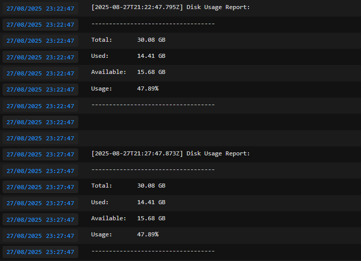

# 💻 Server Space Monitor 

Monitor your server's disk space and send email alerts using Node.js, Express, Nodemailer, and Docker.

## Images
Mail Alert:  


Logs:  


---

## ✨ Features

* **Monitors disk usage** of any specified path (defaults to `/` of the host).
* **Sends email alerts** via SMTP (compatible with Gmail, Outlook, etc.).
* **Configurable** via `.env` variables for:
    * Monitoring interval in minutes.
    * Option to send alerts always or only if a threshold is exceeded.
    * Allowed time frame for sending emails.
* **Runs in a Docker container** with read-only access to the host's file system.
* **Exposes an optional Express port** for health checks or queries.

---
## ⚙️ Configuration (`.env`)

First, copy the `.env.example` file to `.env`:

```bash
cp .env.example .env
```
---

Then, edit the values in your new .env file:

```bash
# App config
PORT=3493

# SMTP Config
SMTP_HOST=smtp.gmail.com
SMTP_PORT=587
SMTP_USER=your_email@gmail.com
SMTP_PASS=your_password_or_token
EMAIL_TO=recipient@gmail.com

# Monitor config
DISK_PATH=/host
THRESHOLD=80        # Maximum allowed percentage
INTERVAL_MINUTES=30 # How often (in minutes) to send alerts
SEND_ALWAYS=false   # true = always send, false = only if THRESHOLD is exceeded

# Allowed hours (24h format)
HOURS_ALLOWED=08-20 # Example: from 08:00 to 20:00
```

### Important Notes
Gmail Users: If you're using Gmail, you'll need to generate an App Password from your Google account with 2FA enabled.

DISK_PATH=/host: The Docker container mounts the host's root directory (/) into /host inside the container, making /host the correct path to monitor.

### Running with Docker

Give execute permissions (first time only):
```bash
chmod +x start.sh
```

Run the script to stop old containers, rebuild the image, and start the app:
```bash
./start.sh
```

View real-time logs:

```Bash
docker logs -f disk-monitor
```

## 🚀 How It Works
The application runs a cron job that checks disk usage at ``DISK_PATH`` every `INTERVAL_MINUTES`.

If the percentage of disk used exceeds THRESHOLD (or if ``SEND_ALWAYS`` is true), an email alert is sent.

Emails are only sent within the ``HOURS_ALLOWED`` time frame.
